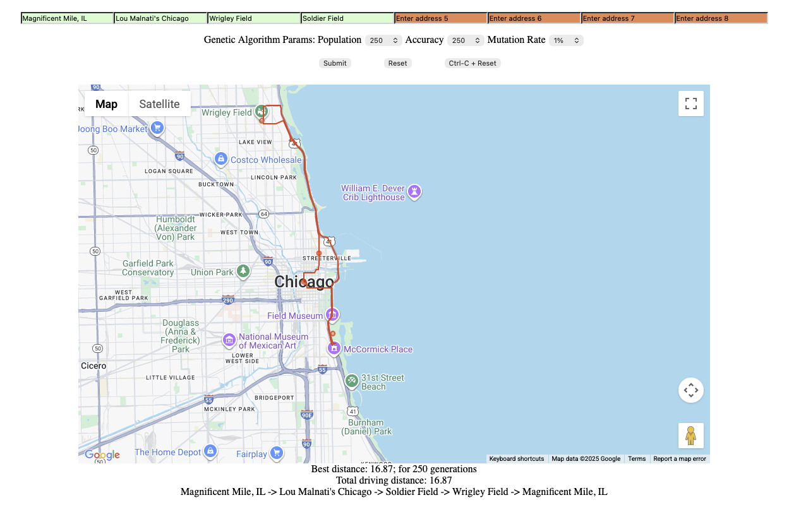
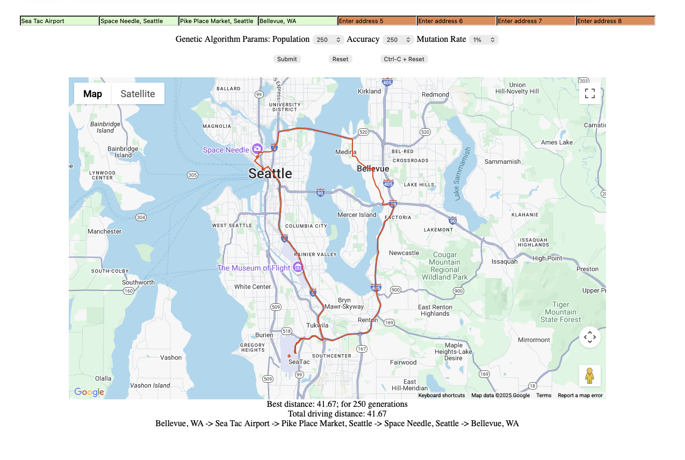
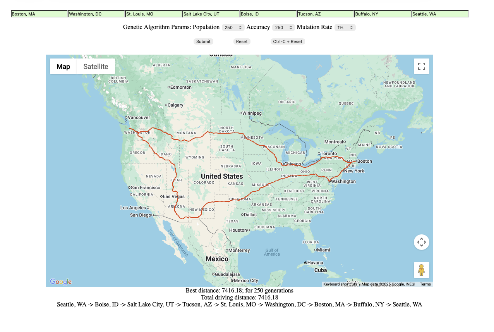

# Traveling Salesman Problem (TSP) App

This project implements a **TSP Solver and Visualizer** using JavaScript, **p5.js**, and the **Google Maps API**.
It allows users to input multiple addresses, computes an optimized visiting order using a **Genetic Algorithm**, and visualizes the route and total distance directly on Google Maps.

I found myself needing a small lightweight app that would determine the optimal round trip for a bunch of errands I was running at the time as well as to plan a road trip to many cities. I took inspiration from Daniel Shiffman’s Coding Train series on Genetic Algorithms and applied it to my own “errand map.” It was a fun way to combine coding, problem-solving, and practical everyday life.

---

*Main interface showing address inputs, controls, and Google Map output.*




---

## File Overview

### **1. `index.html`**

Defines the webpage shell, loads dependencies, and applies styling.

#### Responsibilities

* Loads:

  * **p5.js** — for UI generation and DOM handling.
  * **Google Maps JavaScript API** — for geocoding, directions, and map rendering.
  * **`sketch.js`** — main logic for UI, algorithm, and visualization.
* Includes minimal HTML markup; all UI components are dynamically created.
* Adds styling for layout, inputs, and validation colors.

---

### **2. `sketch.js` (TSP Script)**

Contains all interactive logic, data processing, and the Genetic Algorithm solver.

#### Core Functions

| Function               | Purpose                                                                                                                         |
| ---------------------- | ------------------------------------------------------------------------------------------------------------------------------- |
| `setup()`              | Initializes UI: textboxes, dropdowns, and control buttons.                                                                      |
| `getAddress()`         | Collects user input, geocodes addresses, validates them, and builds the distance matrix.                                        |
| `getCoords()`          | Uses the **Google Geocoding API** to convert addresses into coordinates.                                                        |
| `getDistFromDistAPI()` | Uses the **Google Distance Matrix API** to compute pairwise distances between all addresses.                                    |
| `solveTSP()`           | Calls the Genetic Algorithm (`getBestRoute()`) to find the optimal visiting order.                                              |
| `fetchSegData()`       | Uses the **Google Directions API** to draw the detailed route on the map.                                                       |
| `getBestRoute()`       | Main Genetic Algorithm loop: evolves populations, applies crossover and mutation, tracks best route.                            |
| Utility Functions      | `calcDist`, `calcFitness`, `crossOver`, `sample`, `bestOrderIndex`, `decode`, etc. — helper logic for GA and polyline decoding. |

#### Visualization

* Each location is marked on the Google Map (red = valid, orange = unreachable).
* Optimal route segments are drawn using `Polyline` objects.
* Clicking a segment shows driving distance between those two stops.
* Total route distance and ordered addresses are displayed below the map.

---

## Execution Flow

1. **Setup Phase**
   p5.js automatically calls `setup()` to create all DOM elements.

2. **User Input Phase**
   The user enters up to 8 addresses and sets GA parameters (population size, number of generations, mutation rate). The number of addresses is easily configurable - just change the value of `n` in `sketch.js`. Enter the address as you'd enter in Google Maps - be as precise as you can.

3. **Geocoding & Validation**
   `getAddress()` converts input text into coordinates and removes invalid entries.

4. **Distance Calculation**
   The **Google Distance Matrix API** builds a full pairwise distance matrix.

5. **TSP Optimization**
   `solveTSP()` runs the Genetic Algorithm to find the most efficient round-trip route.

6. **Visualization**
   Routes are plotted on Google Maps, and textual route + distance info is displayed.

7. **Console Logging**
   Open console to see console logs such as the distance matrix, iterations taken, whether any point is unreachable etc.

---

## Setup Instructions

### **1. Requirements**

* Modern browser (Chrome, Edge, or Firefox)
* Internet connection (for API calls)
* A valid **Google Maps JavaScript API key** with the following services enabled:

  * **Geocoding API**
  * **Distance Matrix API**
  * **Directions API**
  * **Maps JavaScript API**

### **2. File Setup**

Your project directory should look like this:

```
tsp-app/
├── index.html
├── sketch.js
└── README.md
```

### **3. Configure API Keys**

Replace all placeholders in your code with your real API key:

In **index.html**:

```html
<script src="https://maps.googleapis.com/maps/api/js?key=<YOUR-GOOGLE-API-KEY>&v=weekly" defer></script>
```

In **sketch.js**, update the following URLs:

```js
"https://maps.googleapis.com/maps/api/geocode/json?key=<YOUR-GOOGLE-API-KEY>&address="
"https://maps.googleapis.com/maps/api/directions/json?key=<YOUR-GOOGLE-API-KEY>&origin=..."
```

> You can reuse a single API key if all the required Google Maps APIs are enabled in your Google Cloud Console.

---

## How to Run the Project

There are several ways to run `index.html`, depending on whether you want to just test it locally or prepare it for deployment.

---

### 🧪 Option 1: Run by Opening `index.html` Directly

1. Locate your project folder (e.g., `tsp-app/`).
2. Double-click **`index.html`** or open it manually in your browser:

   * Right-click → **Open With** → select **Chrome**, **Edge**, or **Firefox**.
3. The page will load and initialize the p5.js sketch and Google Maps script.

✅ **Pros:**

* Easiest option — no setup required.
* Works well for personal experimentation.

⚠️ **Caveat:**

* Some browsers may block local file requests (`file://` URLs), especially if the APIs are called via `fetch()` in your `sketch.js`.
  If you see “CORS” or “Request blocked” errors in the console, use Option 2 below.

---

### Option 2: Run with a Local Web Server (Recommended)

Because Google Maps API calls are external network requests, browsers may enforce **CORS** restrictions when running from the local file system.
To avoid this, serve the files via a lightweight HTTP server.

#### **Using Python**

If you have Python installed:

```bash
# Python 3
python -m http.server 8000
```

Then open your browser and visit:

```
http://localhost:8000
```

#### **Using Node.js (http-server)**

If you use Node.js, install the `http-server` package:

```bash
npm install -g http-server
http-server
```

Then visit the address it prints (usually `http://127.0.0.1:8080`).

✅ **Pros:**

* Avoids all CORS or mixed-content issues.
* Behaves more like a hosted site.

---

### Option 3: Use the p5.js Built-in Server

If you have the **p5.js Editor** or the **p5 Manager CLI** installed, you can easily run this project with its built-in development server.

#### **Using the p5 Editor**

1. Open the **p5.js Editor** ([https://editor.p5js.org/](https://editor.p5js.org/)).
2. Go to **File → Open**, and load your `sketch.js` and `index.html` files.
3. Click **Run** — this automatically serves the project and handles all dependencies.

#### **Using the p5 Manager CLI**

If you prefer working locally with Node.js:

```bash
npm install -g p5-manager
p5 serve
```

Then open your browser at:

```
http://localhost:5555
```

✅ **Pros:**

* Perfect for p5.js-based projects.
* No manual setup of server or dependencies.
* Handles file routing automatically.

---

### ✅ Summary

| Scenario                       | Method                     | Recommended?                     |
| ------------------------------ | -------------------------- | -------------------------------- |
| Quick local test               | Open `index.html` directly | ✅ Easy                           |
| Full local testing (CORS-safe) | Run a local web server     | ✅✅ Best                          |
| p5.js workflow                 | Use the p5.js built-in server | ✅ Ideal for p5 projects          |

---

**Example Workflow:**

1. Clone or download this repository:

   ```bash
   git clone https://github.com/aninagaraj/tsp-app.git
   cd tsp-app
   python -m http.server 8000
   # → Visit http://localhost:8000 in your browser
   ```

2. Enter up to 8 addresses, choose GA parameters, and click **Submit**.

3. The app will:

   * Validate addresses
   * Build a distance matrix
   * Compute the optimal route
   * Display the route on Google Maps with total travel distance

---

> 💡 Tip: The Google Maps JavaScript API script loads asynchronously (`defer`), so the map may take a few seconds to appear on first load.

---

## Technology Stack

| Technology           | Purpose                                                                   |
| -------------------- | ------------------------------------------------------------------------- |
| **p5.js**            | Simplifies DOM handling, UI creation, and lifecycle management            |
| **Google Maps APIs** | Geocoding, distance calculation, directions, and map rendering            |
| **JavaScript (ES6)** | Core logic, asynchronous operations, and Genetic Algorithm implementation |

---

## Summary

> This project combines **Google Maps APIs** and a **Genetic Algorithm** to solve and visualize the Traveling Salesman Problem (TSP) in a user-friendly web interface.
> Users can input real-world addresses, fine-tune algorithm parameters, and view the computed optimal route directly on a live map.

---

## Caveats & Notes

* **Personal/Educational Use Only:**
  This project embeds API keys directly in the source for convenience. This approach is acceptable for **local or private personal use** but **not secure** for public deployment.

* **If you plan to host this publicly**, you must:

  * Store API keys securely (e.g., on a backend server or via environment variables).
  * Restrict key usage by **domain** or **API referrer** in the Google Cloud Console.
  * Be aware of **Google Maps API billing and quota limits**. Each call to Geocoding, Distance Matrix, and Directions APIs may incur costs.

* **Rate Limits:**
  Running multiple route computations in short succession can quickly consume your API quota. Use sparingly for personal testing or small datasets.

  ---

## Demo Gallery

| Run | Description | Screenshot |
|-----|--------------|-------------|
| 1 | Basic route between 4 locations |  |
| 2 | 8-address optimization |  |

## Short blurb on GA

Even though the algorithm itself is not the focus of this project, I created a couple of custom demos to show how GA evolves to find the optimal or near optimal route. The conceptual algorithm is as follows:

1. **Fitness Calculation:** Each tour in the population is evaluated based on its total distance, and a normalized fitness score is computed to favor shorter tours (`calcFitness`).  
2. **Selection:** Two parent tours are probabilistically chosen from the population according to their fitness (`sample`).  
3. **Crossover:** A segment from one parent is copied, and remaining cities are filled from the second parent to produce a new tour (`crossOver`).  
4. **Mutation:** Tours undergo random swaps of cities with a small probability to maintain genetic diversity.  
5. **Iteration:** The population is replaced by the new generation, and the best tour is updated until the stopping condition is met - no improvements in 2500 generations.

I created a custom uncrossing patch that fixes local sub-optimalities when paths cross each other and do not uncross.

### GA Demo 1 - Finding a path through 75 randomly scattered points


### GA Demo 2 - Finding a path through 150 randomly scattered points *on a circle*

This demo shows some limitations of GA. I scattered 150 points randomly on a 300 px radius circle. The shortest distance will be π * 600 = ~1884.954. The GA got to the optimal solution after ~17 minutes and made very slow improvements in between. In the demo video below, the first 100 seconds are at normal speed, the next ~850 seconds are at 10X and the remainder are at normal speed again for a total length of only 4:02 mins. Note that the algorithm stops when it can't improve for 2500 generations at 1884.81 which is near optimality.


---

## Acknowledgements

* Inspired by [**Dan Shiffman’s “The Coding Train”**](https://thecodingtrain.com/) in general and specifically his explanation and visualizations of [**Genetic Algorithm**](https://www.youtube.com/watch?v=9zfeTw-uFCw).
* Created while learning JS and algorithms — and while making something useful for myself.
* I am a recreational coder which means the code is probably not optimized so feel free to use it as is or take it to the next level.