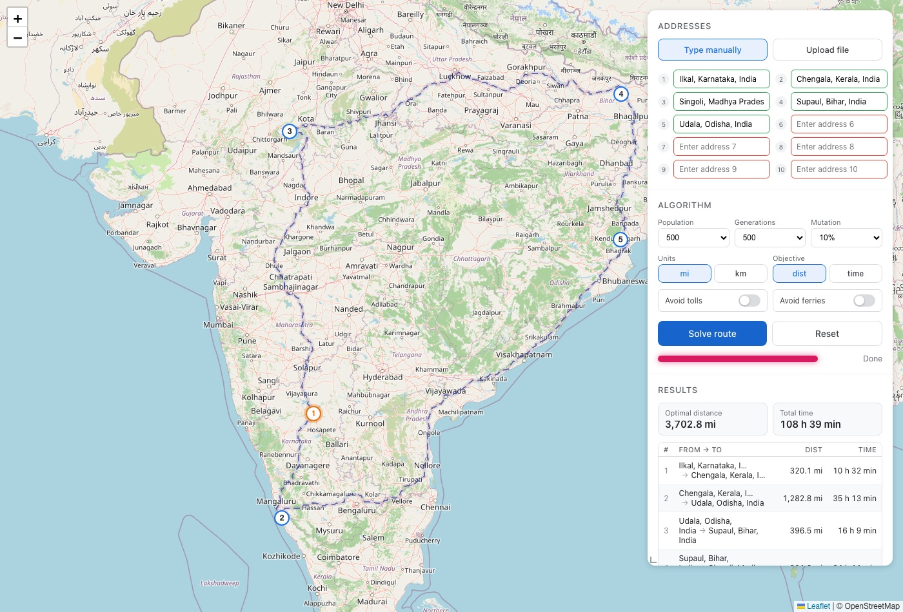
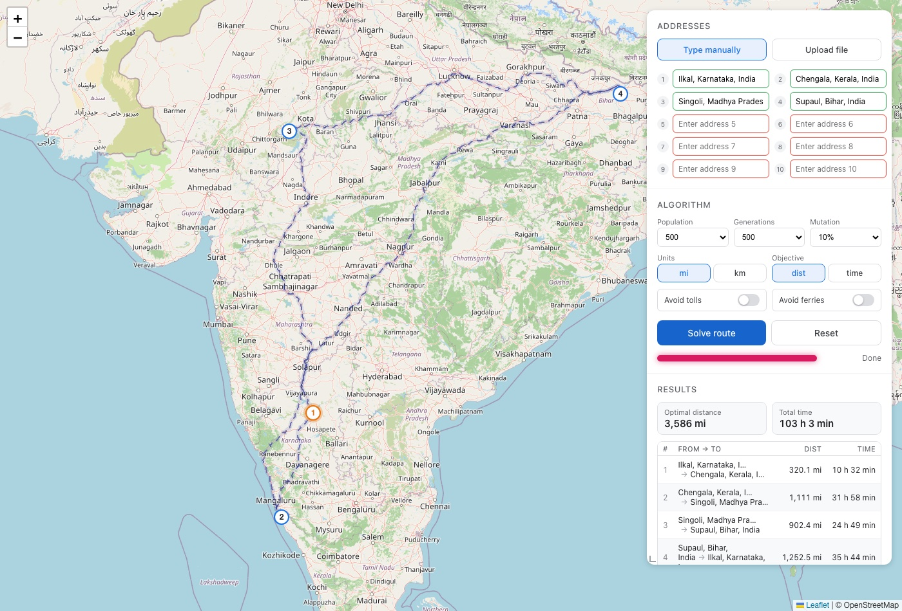
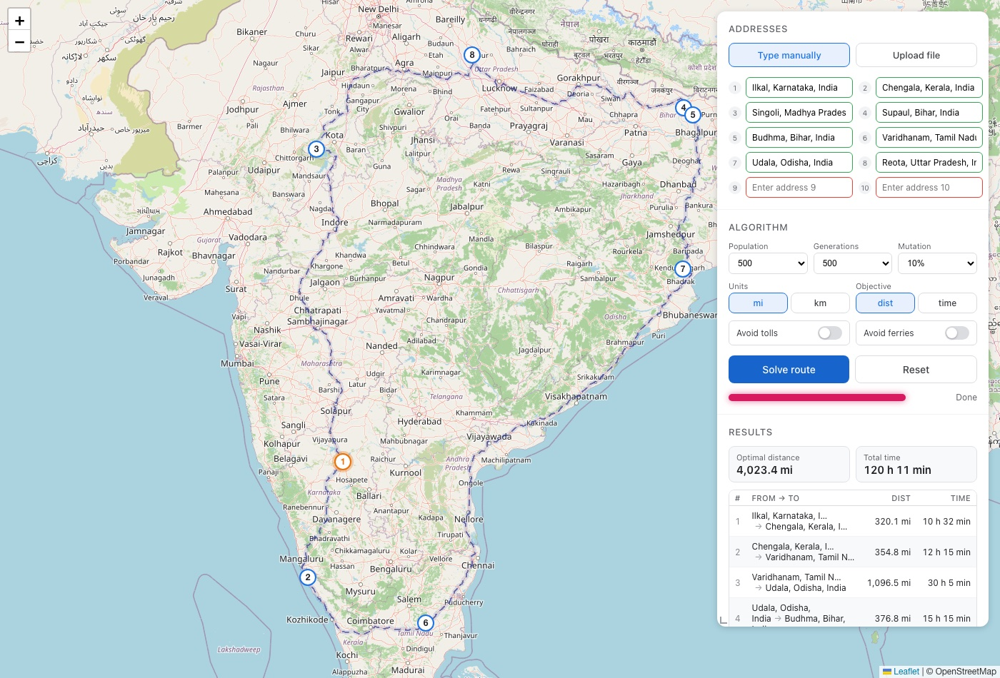
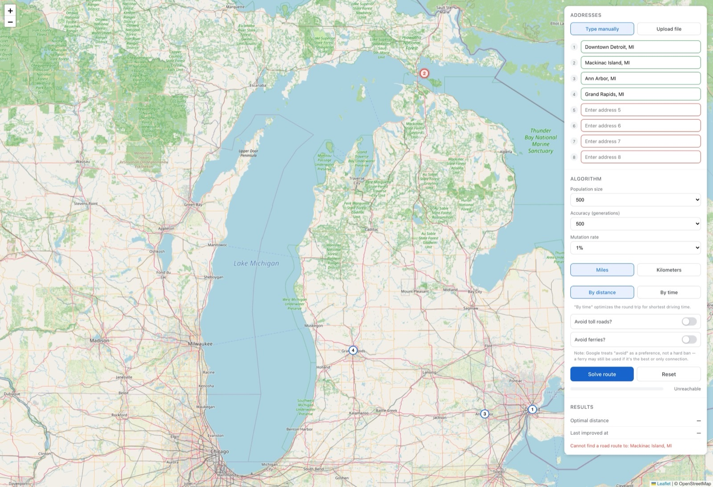
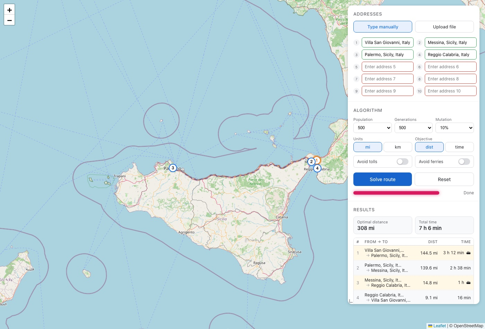
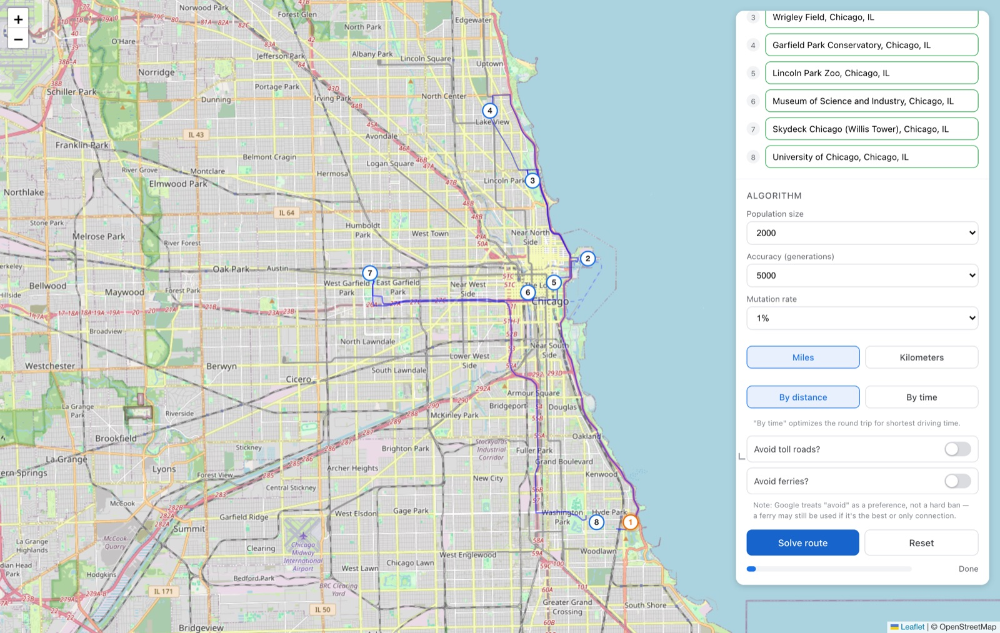

# Routewise

A traveling-salesman-style route optimizer for up to **10 addresses**.

This project implements a **TSP Solver and Visualizer** using **Node.js**, a **Genetic Algorithm**, and the **Google Maps APIs**. It allows users to input multiple addresses, computes an optimized visiting order using a Genetic Algorithm, and visualizes the route and total distance directly on an interactive map (Leaflet/OpenStreetMap).

This repository is the **public mirror** of a private project. The server keeps all Google API keys server-side (in a gitignored `.env`), caches every external API call to disk so repeat solves cost nothing, and streams live solve progress to the browser over Socket.IO.

I found myself needing a small lightweight app that would determine the optimal round trip for a bunch of errands I was running at the time as well as to plan a road trip to many cities. I took inspiration from Daniel Shiffman's Coding Train series on Genetic Algorithms and applied it to my own "errand map." It was a fun way to combine coding, problem-solving, and practical everyday life.

---

*Main interface showing address inputs, controls, and the map output.*



---

## Architecture

```
Browser (Leaflet + socket.io-client)
   │  POST /addresses  (HTTP)        Socket.IO (live progress)
   ▼                                 ▲
Express server (server.js)
   ├─ Geocoding API      → coords        └─ route-update        (interim best tour)
   ├─ Distance Matrix API → dist matrix  └─ generation-progress (progress bar)
   ├─ Directions API     → polylines     └─ geocode-progress    (address validation)
   ├─ Genetic Algorithm  → best route
   └─ cache.js           → disk-persisted LRU cache (api_cache.json)
```

- **HTTP lane:** the browser POSTs the addresses and GA parameters; the server geocodes them, builds a distance/time matrix, runs the GA, fetches turn-by-turn directions for the round trip, and returns the full result.
- **Socket lane:** while solving, the server pushes live interim best-tour updates, generation progress, and per-address geocode results so the page stays responsive.

### The Genetic Algorithm

- **Population** — `Population` random permutations of the cities.
- **Fitness** — each route is scored by total distance; fitness `1 / (1 + d)` is normalized into a cumulative distribution.
- **Selection** — two parents are picked by fitness-proportionate roulette via a **binary search over the CDF** (O(log P)).
- **Crossover** — order crossover (OX): a contiguous block from parent A, remaining cities filled in order from parent B, tracked with a **presence array** (O(n)). A random swap mutation may then occur.
- **Elitism** — the current best tour is guaranteed to survive into the next generation.
- **Repair (2-opt)** — every generation, the best tour gets a bounded 2-opt sweep (up to 100 passes): any pair of edges whose reversal shortens the round trip (removing a crossing) is fixed immediately, keeping the route essentially crossing-free.
- **Champion re-injection** — after 2-opt, the polished best tour is copied into a random non‑elite slot (deduped) so improved edges feed back into OX crossover.
- **Stop condition** — runs for the selected number of generations (`accuracy`). While solving, live diversity (unique tours) and stagnation (generations without improvement) are streamed alongside the progress bar.

## File Overview

```
routewise/
├── server.js          # Express + Socket.IO server: routes, GA solver, cache wiring
├── cache.js           # disk-persisted LRU cache for geocode / matrix / directions calls
├── package.json
├── .env.example       # copy to .env and fill in your API keys
├── .env               # your keys (gitignored — never committed)
├── public/
│   ├── index.html     # the app shell and styles
│   └── sketch.js      # front-end: Leaflet map, controls, socket client, rendering
└── screenshots/       # UI demo screenshots
```

### `server.js` core functions

| Function | Purpose |
| --- | --- |
| `getCoords()` | Geocodes an address to lat/lng + place ID. |
| `getDistFromDistAPI()` | Builds the pairwise distance/time matrix. |
| `solveTSP()` | Main GA loop: evolves populations, applies crossover/mutation/2-opt, tracks the best route. |
| `getPath()` | Fetches turn-by-turn directions for a leg. |
| `twoOpt()` | Per-generation local repair (uncrossing) on the best tour. |
| `calcFitness()` / `sample()` / `crossOver()` | Fitness + CDF, binary-search selection, OX crossover. |

## Setup Instructions

### 1. Requirements

- Node.js (14+)
- A valid **Google Cloud Platform API key** with the following APIs enabled:
  - **Geocoding API**
  - **Distance Matrix API**
  - **Directions API**

### 2. Install and configure

```bash
npm install
cp .env.example .env
```

Fill in `.env` with your keys:

```
API_GEOCODE=...
API_DIST_MATRIX=
```

### 3. Run

```bash
npm start        # or: node server.js
```

Then open `http://localhost:5555` (or set `PORT` to change it). The app also serves on your LAN, so you can open it from another device on the same network.

## How to Use

1. Enter up to 10 addresses (or upload a `.txt`/`.csv` file, one address per line).
2. Choose the GA parameters: **Population**, **Accuracy (generations)**, **Mutation Rate**.
3. Optionally switch **units** (miles/km), the **objective** (by distance or by time), and toggle **avoid tolls/ferries**.
4. Click **Solve route**.
5. Watch the live progress: addresses validate in place, the progress bar fills (showing generation %, live diversity, and stagnation count), the best-so-far distance updates in real time, and an interim tour is drawn as the GA runs.
6. The final round trip is drawn on the map with dashed, glow-haloed polylines (deep indigo for regular segments, amber for ferry legs — optimized for contrast against OpenStreetMap tiles), numbered stops, and each segment's distance/duration listed below.
7. Click **Animate route** to send a glowing dot along the solved tour at 60 fps; the button becomes **Replay** when the tour finishes. The round trip is rotated to start from the first valid address you entered.

> Any address that can't be reached by road is flagged as unreachable, and the solver will not run until it's removed.

## Technology Stack

| Technology | Purpose |
| --- | --- |
| **Node.js + Express** | Server, routing, API proxying, static hosting |
| **Socket.IO** | Live solve progress streaming |
| **Google Maps APIs** | Geocoding, distance/time matrix, turn-by-turn directions |
| **Leaflet + OpenStreetMap** | Free, keyless map rendering |
| **Genetic Algorithm** | TSP route optimization (with 2-opt repair) |

---

## Short blurb on GA

Even though the algorithm itself is not the focus of this project, the genetic algorithm does the heavy lifting of finding a near-optimal visiting order:

1. **Fitness Calculation:** Each tour in the population is evaluated by its total distance, and normalized into a selection distribution.
2. **Selection:** Two parent tours are probabilistically chosen according to their fitness (binary search over the CDF).
3. **Crossover:** A segment from one parent is copied, and the remaining cities are filled from the second parent in order.
4. **Mutation:** Tours undergo random swaps with a small probability to maintain diversity.
5. **2-opt repair:** The best tour is locally un-crossed every generation with up to 100 sweeps.
6. **Champion re-injection:** The 2-opt polished best tour is copied into a random non-elite slot (deduped) every generation, feeding improved edges back into OX crossover.
7. **Iteration:** The population is replaced, and the best tour is tracked until the generation budget is met. Live diversity (unique tours) and stagnation (generations without improvement) are streamed to the browser alongside the progress bar.

## Demo Gallery

> _Captured with the current build (up to 10 addresses), using Playwright against live solves._

| Run | Description | Screenshot |
|-----|--------------|-------------|
| 1 | Basic route between 4 locations |  |
| 2 | 8-address optimization |  |
| 3 | Unreachable destination |  |
| 4 | Ferries |  |
| 5 | Live progress while solving (interim best-so-far tour + progress bar) |  |

## Caveats & Notes

- **Personal/Educational Use Only.** This project is a learning project and is not optimized; feel free to use it as-is or take it to the next level.
- **API keys are kept server-side** in `.env` (gitignored) — never commit them.
- **API costs:** each call to Geocoding, Distance Matrix, and Directions may incur Google Cloud costs. This app caches every external call to `api_cache.json` so repeat solves hit the cache instead of the APIs.
- **Rate limits:** running many route computations in short succession can consume your quota; the disk cache reduces this.
- TSP is solved by a heuristic GA, so results are near-optimal, not guaranteed optimal.

## Acknowledgements

- Inspired by [**Dan Shiffman's "The Coding Train"**](https://thecodingtrain.com/) in general and specifically his explanation and visualizations of [**Genetic Algorithm**](https://www.youtube.com/watch?v=9zfeTw-uFCw).
- Created while learning JS and algorithms — and while making something useful for myself.
- I am a recreational coder which means the code is probably not optimized so feel free to use it as is or take it to the next level.
